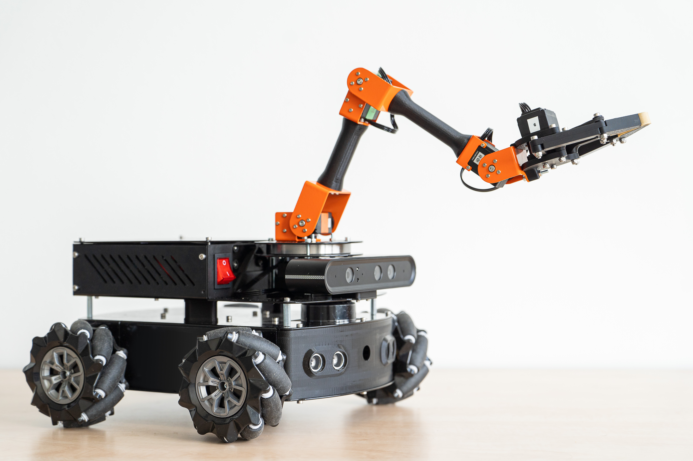

+++ { "kind": "split-image" }

## Lab Cleanup Robot using Mirte Master Platform

a quick setup for your open publishing project.

{button}`View Source code <https://github.com/matt-rbt/Mirte_Lab_Clean.git>`  
{button}`View Documentation <https://matt-rbt.github.io/Mirte_Lab_Clean/build/html/index.html>`
<!-- {button}`Download Process <https://matt-rbt.github.io/Mirte_Lab_Clean/build/html/index.html>` -->

+++

This thesis reports on the application of the Mirte Master Platform to lab cleanup and sorting. It covers aspects such as perception and classification and cleanup strategies

